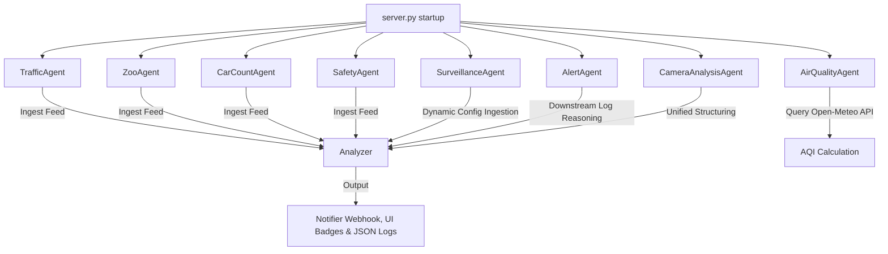

# Autonomous AI Agents Architecture

This document describes the design, responsibilities, schedules, and operations of the background AI monitoring agents running in the project. All agents are run concurrently as daemon threads started when `server.py` boots, or run on-demand as helpers.

---

## 1. Agent Overview

All agents share a modular design pattern:
1. **Target Feed Ingestion**: Retrieve camera nodes and query the latest frames or coordinates.
2. **AI Analysis**: Pass frame URLs/coordinates and objective prompts to the `Analyzer` layer (Gemini API).
3. **Notification & Metadata Storage**: Save parsed results directly in-place on the device/camera dictionary objects (updating UI badges) and/or dispatch alerts via the `Notifier` to console logs and webhook endpoints (e.g. Slack/Discord).



---

## 2. Agent Profiles

### 🚦 TrafficAgent
* **Implementation**: [agents/traffic_agent.py](file:///Users/madhugupta/.gemini/antigravity/worktrees/google-hackathon/car-count-cron-agent/agents/traffic_agent.py)
* **Target Feed**: `CaltransFeed` (active highway cameras)
* **Frequency**: Every 5 minutes (300 seconds)
* **Objective Prompt**: `hazard` preset ("Look closely at the highway lane. Check if there are any accidents, stalled vehicles, debris, construction, or hazards...")
* **Trigger Conditions**: Alerts if the analysis response contains keywords like `hazard`, `parked`, `shoulder`, `closure`, `accident`, or `delay`.

---

### 🐼 ZooAgent
* **Implementation**: [agents/zoo_agent.py](file:///Users/madhugupta/.gemini/antigravity/worktrees/google-hackathon/car-count-cron-agent/agents/zoo_agent.py)
* **Target Feed**: `ZooFeed` (all 5 enclosures)
* **Frequency**: Every 5 minutes (300 seconds)
* **Objective Prompt**: `hazard` (maps to behavior/activity levels in the enclosure presets)
* **Trigger Conditions**: Alerts if the response contains activity words like `high`, `play`, `splashing`, `running`, or `active`.

---

### 📊 CarCountAgent
* **Implementation**: [agents/car_count_agent.py](file:///Users/madhugupta/.gemini/antigravity/worktrees/google-hackathon/car-count-cron-agent/agents/car_count_agent.py)
* **Target Feeds**: Both `CaltransFeed` (active highway cameras) and `ZooFeed` (all 5 enclosures)
* **Frequency**: Every 5 minutes (300 seconds)
* **Objective Prompt**: `count` ("Count the approximate number of vehicles/animals visible in this image...")
* **UI Integration**: 
  * Parses text outputs using a regex-based helper `extract_count_summary` to generate clean summary counts (e.g. `"24 Vehicles"`, `"3 Animals"`).
  * Stores `latest_count_summary` and `latest_count_details` directly on the camera dictionary objects in-place, which are fetched by the frontend to render neon count badges on the map gallery and node lists.

---

### 🛡️ SafetyAgent
* **Implementation**: [agents/safety_agent.py](file:///Users/madhugupta/.gemini/antigravity/worktrees/google-hackathon/car-count-cron-agent/agents/safety_agent.py)
* **Target Feed**: `CaltransFeed` (highway cameras)
* **Frequency**: Loops every 10 seconds to check for camera updates; checks each camera every 5 minutes (300 seconds).
* **Objective Prompt**: `safety` (evaluates roads for accidents, collisions, lane blockages, or stalled vehicles)
* **Trigger Conditions**: Populates `safety_summary` and `safety_details` in camera metadata. Dispatches alerts if safety summary matches `Accident`, `Collision`, or `Hazard`.

---

### 🌬️ AirQualityAgent
* **Implementation**: [agents/air_quality_agent.py](file:///Users/madhugupta/.gemini/antigravity/worktrees/google-hackathon/car-count-cron-agent/agents/air_quality_agent.py)
* **Target Feed**: `CaltransFeed` (highway cameras)
* **Frequency**: Checks camera list every 30 seconds; updates each camera's air quality stats every 30 minutes (1800 seconds).
* **Operation**: Resolves the coordinates (latitude, longitude) of active nodes and queries the free **Open-Meteo Air Quality API**.
* **UI Integration**: Maps US AQI indexes to human-readable summaries (Good, Moderate, Unhealthy*, Unhealthy, Very Unhealthy, Hazardous) and CSS color categories. Stores `air_quality_aqi`, `air_quality_summary`, and `air_quality_css_class` directly in camera objects.

---

### 🔍 ScavengerAgent
* **Implementation**: [agents/scavenger_agent.py](file:///Users/madhugupta/.gemini/antigravity/worktrees/google-hackathon/car-count-cron-agent/agents/scavenger_agent.py)
* **Target Feed**: `CaltransFeed` (highway cameras)
* **Frequency**: On-demand / Route-based scanning
* **Operation**: Analyzes all cameras along a driver's selected route using a structured prompt (`ROUTE_PROMPT`). Evaluates and categorizes observations under `CONGESTION`, `CONSTRUCTION`, `WEATHER`, `HAZARD`, `QUIRKY`, or `ALL_CLEAR`.
* **Output**: Returns a list of notable observations (max 15 words) tagged with thematic emojis.

---

### 📡 SurveillanceAgent
* **Implementation**: [agents/surveillance_agent.py](file:///Users/madhugupta/.gemini/antigravity/worktrees/google-hackathon/car-count-cron-agent/agents/surveillance_agent.py)
* **Target Feeds**: Both `CaltransFeed` and `ZooFeed`
* **Frequency**: Loops every 30 seconds
* **Dynamic Configuration**: Loads analysis prompts and individual target parameters dynamically from [intelligence/surveillance_config.json](file:///Users/madhugupta/.gemini/antigravity/worktrees/google-hackathon/car-count-cron-agent/intelligence/surveillance_config.json).
* **Logging**: Writes custom prompt multimodal analysis logs to [outputs/surveillance_log.json](file:///Users/madhugupta/.gemini/antigravity/worktrees/google-hackathon/car-count-cron-agent/outputs/surveillance_log.json) (capped at 100 entries).

---

### 🔔 AlertAgent
* **Implementation**: [agents/alert_agent.py](file:///Users/madhugupta/.gemini/antigravity/worktrees/google-hackathon/car-count-cron-agent/agents/alert_agent.py)
* **Target Source**: Downstream log entries in `outputs/analysis_log.json` (written by `CameraAnalysisAgent`)
* **Frequency**: Every 15 seconds
* **Objective Prompt**: Uses Gemini text reasoning to determine if structured safety notes or anomaly reports warrant raising a high-priority alert notification.
* **Skip logic**: Skips safe logs without API calls. Marks processed log objects in-place with `processed: true`, `alert_triggered`, and `alert_reason`.

---

### 📷 CameraAnalysisAgent
* **Implementation**: [agents/camera_analysis_agent.py](file:///Users/madhugupta/.gemini/antigravity/worktrees/google-hackathon/car-count-cron-agent/agents/camera_analysis_agent.py)
* **Target Feeds**: Both `CaltransFeed` and `ZooFeed`
* **Frequency**: Every 10 seconds (analyzes due cameras based on `surveillance_config.json` check intervals)
* **Operation**: Structured unified monitoring agent that replaces the separate analysis loops of individual agents to make **one structured Gemini call per camera per cycle**, populating UI badge metadata and appending raw JSON summaries to `outputs/analysis_log.json` for the AlertAgent.

---

## 3. Integration & Common Operations

### Frame Ingestion
Agents query the latest frame from the feed using:
```python
img_url = self.feed.get_latest_frame(dev_id)
```

### Alerting Protocol
Console and webhook dispatches are handled uniformly:
```python
self.notifier.notify(message)
```
This formats messages and pushes alerts to any Discord/Slack endpoint specified in the `NOTIFICATION_WEBHOOK_URL` environment variable.
