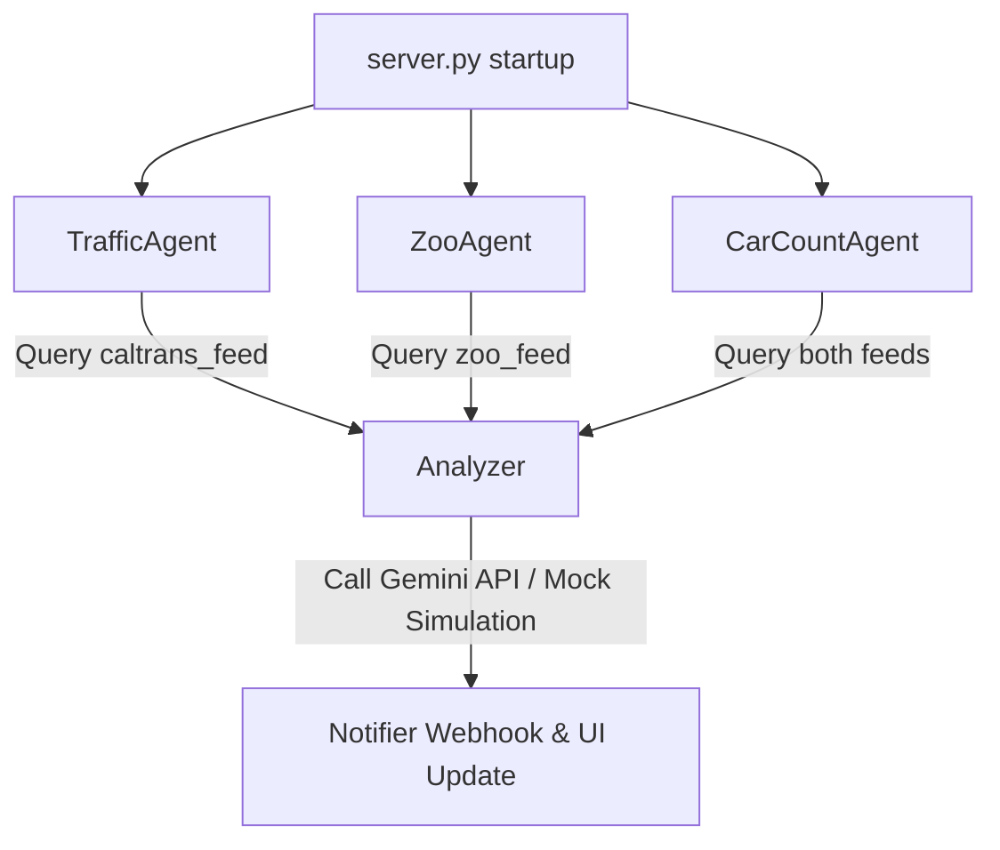

# Autonomous AI Agents Architecture

This document describes the design, responsibilities, schedules, and operations of the three background AI monitoring agents running in the project. All agents are run concurrently as daemon threads started when `server.py` boots.

---

## 1. Agent Overview

All agents share a unified design pattern:
1. **Target Feed Ingestion**: Read camera nodes and query the latest frames.
2. **AI Analysis**: Pass frame URLs and objective prompts to the `Analyzer` layer.
3. **Notification**: Send alerts via the `Notifier` component to console logs and webhook endpoints (e.g. Slack/Discord).



---

## 2. Agent Profiles

### 🚦 TrafficAgent
* **Implementation**: [agents/traffic_agent.py](file:///Users/madhugupta/.gemini/antigravity/worktrees/google-hackathon/car-count-cron-agent/agents/traffic_agent.py)
* **Target Feed**: `CaltransFeed` (first 3 major commute cameras)
* **Frequency**: Every 5 minutes (300 seconds)
* **Objective Prompt**: `hazard` ("Look closely at the highway lane. Check if there are any accidents, stalled vehicles, debris, construction, or hazards...")
* **Trigger Conditions**: Alerts if the analysis response contains words like `hazard`, `parked`, `shoulder`, `closure`, `accident`, or `delay`.

---

### 🐼 ZooAgent
* **Implementation**: [agents/zoo_agent.py](file:///Users/madhugupta/.gemini/antigravity/worktrees/google-hackathon/car-count-cron-agent/agents/zoo_agent.py)
* **Target Feed**: `ZooFeed` (all 5 enclosures)
* **Frequency**: Every 5 minutes (300 seconds)
* **Objective Prompt**: `hazard` (which maps to behavior/activity levels in the enclosure presets)
* **Trigger Conditions**: Alerts if the response contains words like `high`, `play`, `splashing`, `running`, or `active`.

---

### 📊 CarCountAgent
* **Implementation**: [agents/car_count_agent.py](file:///Users/madhugupta/.gemini/antigravity/worktrees/google-hackathon/car-count-cron-agent/agents/car_count_agent.py)
* **Target Feeds**: Both `CaltransFeed` (first 3 cameras) and `ZooFeed` (all 5 enclosures)
* **Frequency**: Every 5 minutes (300 seconds)
* **Objective Prompt**: `count` ("Count the approximate number of vehicles/animals visible in this image...")
* **UI Integration**: 
  * Parses text outputs using a regex-based helper `extract_count_summary` to generate clean summary counts (e.g. `"24 Vehicles"`, `"3 Animals"`).
  * Stores `latest_count_summary` and `latest_count_details` directly on the camera dictionary objects in-place.
  * These values are fetched dynamically by the frontend to render neon count badges on the card gallery and node directory lists.

---

## 3. Integration & Common Operations

### Frame Retrieval (`get_latest_frame`)
To ensure agents always inspect the newest camera data, they call:
```python
img_url = self.feed.get_latest_frame(dev_id)
```
This returns the static image URL proxy endpoint, which the server uses to download and process the image.

### Alerting Protocol
When alert criteria are met, agents execute:
```python
self.notifier.notify(message)
```
This prints the alert to the server console and pushes the notification to any webhook URL configured in the `NOTIFICATION_WEBHOOK_URL` environment variable.
